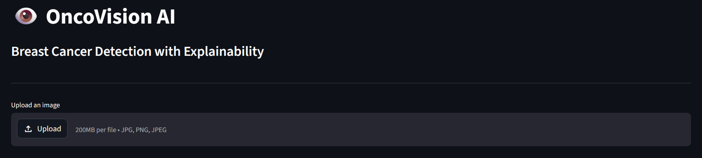
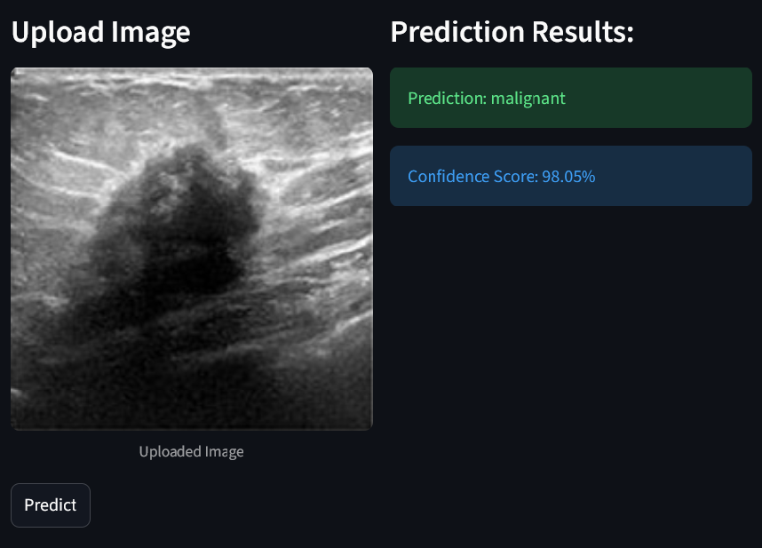
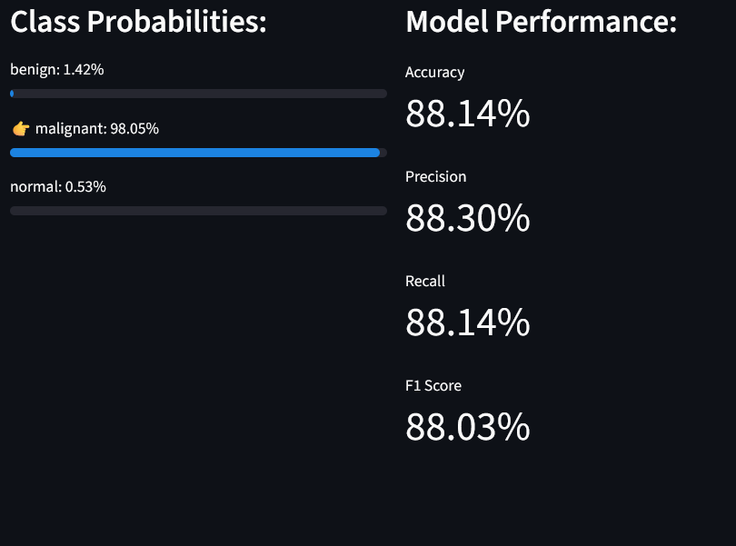
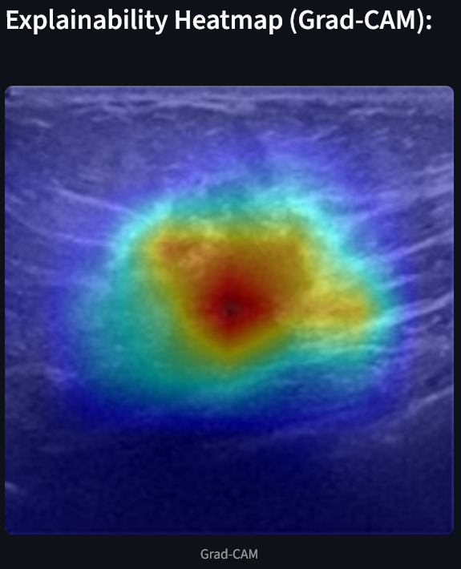
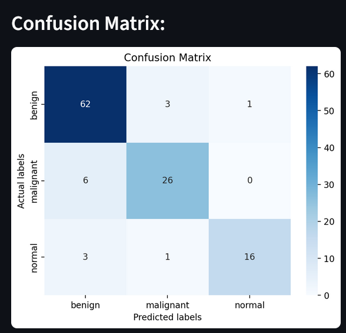
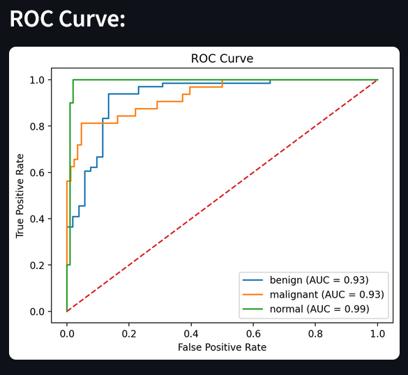

# 👁️ OncoVision AI — Breast Cancer Detection System

## Overview
OncoVision AI is a deep learning-based medical imaging system designed to classify breast cancer images using ensemble learning and provide visual explanations using Grad-CAM.

This project demonstrates a complete end-to-end ML pipeline:

* Model training
* Ensemble learning
* API deployment
* Interactive UI
* Explainability

## Tech Stack
* Python
* PyTorch
* FastAPI
* Streamlit
* Scikit-learn
* OpenCV
* Grad-CAM

## Problem Statement
Early and accurate detection of breast cancer is critical.

This system aims to:

* Improve diagnostic accuracy using deep learning
* Reduce false negatives (missed cancer cases)
* Provide visual explanations for trust and interpretability

## Key Features
* Ensemble Model (EfficientNetV2 + DenseNet)
* FastAPI Backend
* Streamlit Interactive UI
* Grad-CAM Explainability
* Metrics Dashboard (Accuracy, Precision, Recall, F1)
* Confusion Matrix Visualization
* ROC Curve Analysis
* Error Handling & Robust UI

## Architecture
User → Streamlit UI → FastAPI → Ensemble Model → Prediction + Grad-CAM

## Demo

### User Interface


---

### Prediction Output



---

### Grad-CAM Explainability


---

### Confusion Matrix


---

### ROC Curve


## How to Run
```bash
1. Clone Repository
    git clone https://github.com/Shadow-code-dev/oncovision-ai.git
    cd oncovision-ai
2. Install Dependencies
    pip install -r requirements.txt
3. Start Backend (FastAPI)
   uvicorn app.main:app --reload
4. Start Frontend (Streamlit)
   streamlit run app/streamlit_app.py